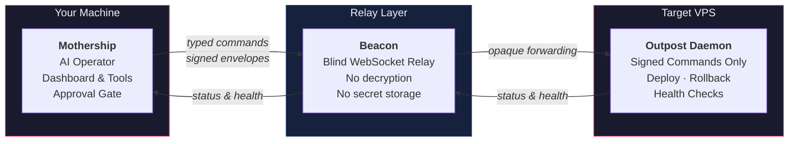

<p align="center">
  <br>
  <picture>
    <source media="(prefers-color-scheme: dark)" width="620">
    <source media="(prefers-color-scheme: light)" width="620">
    <pre align="center">

        ██████╗ ██╗   ██╗████████╗██████╗  ██████╗ ███████╗████████╗
       ██╔═══██╗██║   ██║╚══██╔══╝██╔══██╗██╔═══██╗██╔════╝╚══██╔══╝
       ██║   ██║██║   ██║   ██║   ██████╔╝██║   ██║███████╗   ██║
       ██║   ██║██║   ██║   ██║   ██╔═══╝ ██║   ██║╚════██║   ██║
       ╚██████╔╝╚██████╔╝   ██║   ██║     ╚██████╔╝███████║   ██║
        ╚═════╝  ╚═════╝    ╚═╝   ╚═╝      ╚═════╝ ╚══════╝   ╚═╝
    
  </picture>
</p>

<p align="center">
  <strong>AI-first deployment harness for user-owned infrastructure</strong>
</p>

<p align="center">
  <a href="https://nodejs.org"></a>
  
  
  <a href="#install"></a>
</p>

<br>

---

Outpost is a **deployment-specific** AI harness. Describe what you want deployed — Mothership plans the work, calls provisioning and deployment tools, streams status updates, asks for approval according to your settings, and records everything that happened.

Think of it like Claude Code or Codex, but scoped exclusively to deployment. No arbitrary shell commands through the relay. No SaaS dependency. No secrets leaving your machine.

---

<br>

## Architecture



<br>

### Three Moving Parts

| Component | Role | Runs on |
| :--- | :--- | :--- |
| **Mothership** | AI operator, dashboard, tool runner, approval gate, provider manager, operation history | Your machine |
| **Beacon** | Blind WebSocket relay — forwards opaque messages, never decrypts or stores secrets | Any reachable server |
| **Outpost Daemon** | Target-side agent — accepts only signed typed commands | Target VPS |

<br>

---

## Authority Modes

Outpost operates in two distinct modes, bridged by an integrated SSH bootstrapper.

<br>

| | Local Host Mode | Beacon Strict Mode |
| :--- | :--- | :--- |
| **Where Mothership runs** | On the managed host itself | On a separate machine |
| **Communication** | Direct local access | Via Beacon WebSocket relay |
| **Command surface** | Shell + tools (gated by approval) | Typed commands only |
| **Arbitrary shell** | Yes (subject to approval) | Never |
| **NAT traversal** | N/A | Handled by Beacon |
| **Best for** | Single VPS, staging, dev boxes | Multi-target production, locked-down targets |

<br>

### SSH Bootstrapper

Mothership can connect to a remote VPS over SSH to inspect its OS, run bootstrap commands, configure runtimes, and install the Outpost daemon — all before the Beacon relay is running. Set `runtimeSource: "local"` to transfer and build sources on the target directly from the monorepo.

<br>

---

## Quick Start

### 1. Install

```bash
git clone https://github.com/outpost/outpost
cd outpost
npm install
```

### 2. Build

```bash
npm run typecheck
npm run build
```

### 3. Start the Relay

```bash
node packages/beacon/dist/cli.js --port 8787
```

### 4. Start Mothership

```bash
PORT=4173 node packages/mothership/dist/cli.js start
```

### 5. Open the Dashboard

```
http://127.0.0.1:4173
```

<br>

> **Isolated development:** override `HOME` to keep state separate.
> ```bash
> HOME=/tmp/outpost-mothership-home PORT=4173 node packages/mothership/dist/cli.js start
> ```

<br>

---

## Dashboard Capabilities

- **AI Operator** — deployment prompts, plans, tool calls, approvals, status updates
- **Provider Settings** — OpenAI and OpenRouter configuration
- **Approval Modes** — granular control over autonomous tool execution
- **Target Inventory** — managed hosts and paired Outpost instances
- **App Inventory** — deployed applications across targets
- **Beacon Pairing** — generate pairing payloads for new targets
- **Operation History** — full audit log of provisioning and deployment runs
- **Deploy / Rollback / Doctor / Health Check / Logs** — typed workflows

<br>

---

## Approval Modes

Choose how much autonomy Mothership has. Default is **automatic**.

| Mode | Behavior |
| :--- | :--- |
| **Automatic** | Run deployment tools without prompting; record all tool calls |
| **Confirm Risky** | Ask before destructive, security-sensitive, or broad infrastructure changes |
| **Confirm External** | Ask before changing anything outside local state or the current app workspace |
| **Manual** | Ask before each meaningful action |

> Approval settings affect Mothership only. They do **not** weaken Beacon strict mode.

<br>

---

## AI Providers

Mothership requires at least one configured provider before any deployment operations.

| Provider | Status |
| :--- | :--- |
| OpenAI | Supported |
| OpenRouter | Supported |

Provider keys are stored in `~/.outpost/mothership/ai-secrets.json` and never leave Mothership.

<br>

---

## Adding a Target

<p align="center">
  <br>
  <picture>
    <pre align="left">

                 Local Host Mode                      Beacon Strict Mode

     ┌──────────────────────┐              ┌──────────────┐    ┌──────────┐    ┌──────────────┐
     │     Mothership       │              │  Mothership  │    │  Beacon  │    │   Outpost    │
     │     Local VPS        │              │  Your Laptop │◄──►│  Relay   │◄──►│  Target VPS  │
     │  ┌────────────────┐  │              │              │ WS │          │ WS │              │
     │  │  shell access  │  │              └──────────────┘    └──────────┘    └──────────────┘
     │  │  provisioning  │  │
     │  │  systemd       │  │
     │  │  nginx/caddy   │  │
     │  └────────────────┘  │
     └──────────────────────┘
    </pre>
  </picture>
</p>

<br>

### Local Host Mode

Run Mothership directly on the target VPS. It can inspect and provision the host directly.

Typical workflow:
- Detect OS and package manager
- Install or validate runtimes
- Clone repositories, create app directories
- Write environment files and systemd services
- Configure nginx or Caddy
- Check firewall and TLS status
- Deploy and health check apps

### Beacon Strict Mode

Use when Mothership is not on the target host.

1. Mothership generates a pairing payload
2. Outpost daemon is installed on the target
3. Outpost pins Mothership's public key
4. Outpost connects through Beacon
5. Mothership sends **only** signed typed commands

**Allowed typed commands:** `GET_STATE` · `DOCTOR` · `DETECT_APP` · `DEPLOY` · `ROLLBACK` · `SET_ENV` · `RUN_HEALTH_CHECK` · `APPLY_RECIPE`

> 🚫 Generic shell commands are **never** permitted through Beacon.

<br>

---

## Deployment Recipes

Apps are deployed through recipes — typed definitions for detection, provisioning, deployment, health checking, and rollback.

| Recipe | Maturity |
| :--- | :--- |
| Static / Vite apps | Most mature |
| Generic static build outputs | Stable |
| Node.js services (systemd) | Stable |
| Server-rendered JavaScript apps | In progress |
| Docker / Docker Compose | Stable |

Custom recipes are supported through the plugin system under `~/.outpost/mothership/plugins/`.

<br>

---

## Deploy Flow (Static)

1. Verify the signed command
2. Ensure clean git working tree
3. `git fetch --all --prune`
4. Checkout branch or commit (if specified)
5. Run `installCommand` (if configured)
6. Run `buildCommand`
7. Copy `outputDir` → `.outpost/releases/<release-id>/`
8. Atomically update `.outpost/live` → new release
9. Prune old successful releases beyond `retainReleases`

<br>

---

## Rollback

Rollback switches `.outpost/live` to an existing release **without rebuilding**. Node services additionally restart the previous systemd unit. Every rollback is audited in operation history.

<br>

---

## Local State

Mothership stores all data under `~/.outpost/mothership/`:

```
~/.outpost/mothership/
├── mothership_private.pem
├── mothership_public.pem
├── config.json
├── providers.json
├── ai-secrets.json        ← never leaves Mothership
├── approvals.json
├── targets.json
├── apps.json
├── operations.json
├── tools/
└── plugins/
```

> AI secrets, tools, plugins, and operation history are local-only. They are **not** copied to Beacon or Outpost hosts.

<br>

---

## Repository Layout

```
packages/
├── protocol/      Shared types and validators (Zod)
├── shared/        Crypto, config, filesystem, logging, release helpers
├── beacon/        WebSocket relay server
├── mothership/    AI operator, dashboard, providers, tools, approvals
└── daemon/        Target-side daemon and CLI
```

<br>

---

## Development

```bash
npm run typecheck      # Type-check all packages
npm run build          # Build all packages (output → dist/)
npm run clean          # Clean build artifacts
npm run lint           # Lint with ESLint
npm run format         # Format with Prettier
```

Run both Beacon and Mothership for development:

```bash
# Terminal 1 — relay
node packages/beacon/dist/cli.js --port 8787

# Terminal 2 — dashboard
PORT=4173 node packages/mothership/dist/cli.js start
```

Then open **http://127.0.0.1:4173**

<br>

---

## FAQ

<details>
<summary><b>Why Outpost over Claude Code for deployment?</b></summary>
<br>

Claude Code is a general-purpose coding assistant. It can run shell commands over SSH, but has no structured deployment model — no typed commands, no signed envelopes, no approval gates keyed to operation risk, no blind relay for NAT traversal, and no rollback strategy.

Outpost has a deployment-specific security model. In Beacon strict mode, the daemon accepts only typed commands (`DEPLOY`, `ROLLBACK`, `DOCTOR`, etc.). Every command is a signed envelope pinned to Mothership's public key. Beacon cannot decrypt or interpret payloads. Approval modes let you tune autonomy per operation category.

A deployment-specific harness with bounded commands, health checks, and automatic rollback is safer than a general-purpose shell executor.

</details>

<details>
<summary><b>What makes Outpost different from other deployment tools?</b></summary>
<br>

Most tools are either fully manual (write your own scripts) or fully automated CI/CD (configure YAML, push). Outpost is **AI-first**: you describe what you want, the AI Operator plans it, calls tools, asks for approval per your settings, and streams status as it happens. It runs on your infrastructure with no SaaS dependency. All secrets, keys, and history stay local.

</details>

<details>
<summary><b>Is Outpost safe for production?</b></summary>
<br>

Outpost was designed with a production safety model from the start:
- **Beacon strict mode** — no arbitrary shell on remote targets
- **Typed, signed commands** — every Beacon-mode command is verified
- **Automatic rollback** — failed deployments revert to last known-good release
- **Full audit trail** — every operation is logged
- **Granular approvals** — require human confirmation for destructive changes

Outpost is currently at **v0.1.0** and in active development. Exercise appropriate caution.

</details>

<details>
<summary><b>What kinds of apps can Outpost deploy?</b></summary>
<br>

Recipes exist for static/Vite apps, Node.js services (with systemd), and Docker Compose apps. Broader recipe support is on the roadmap. Custom recipes available through the plugin system.

</details>

<details>
<summary><b>What happens when a deployment fails?</b></summary>
<br>

The previous working release stays active and the recipe's rollback strategy triggers. For static releases: `.outpost/live` symlink reverts. For Node services: symlink reverts and the previous service restarts. Failures appear in the operation history and AI Operator with full status context.

</details>

<details>
<summary><b>Does Outpost need root access?</b></summary>
<br>

Not necessarily. In local host mode, Mothership can run provisioners needing elevated privileges (installing packages, writing systemd units, configuring web servers) — approval mode controls whether those run automatically. The Outpost daemon needs only the permissions required by the app it manages. Systemd units can install as user units under `~/.config/systemd/user/`.

</details>

<details>
<summary><b>How does Outpost handle secrets?</b></summary>
<br>

Provider keys are stored in `~/.outpost/mothership/ai-secrets.json` and never leave Mothership. Beacon cannot decrypt payloads or store secrets. App environment variables are set via the `SET_ENV` typed command and redacted from logs and status messages.

</details>

<details>
<summary><b>Can I use Outpost without an AI provider?</b></summary>
<br>

No. Mothership gates deployment operations behind at least one configured and validated AI provider (OpenAI or OpenRouter). The AI Operator plans the work, selects tools, and drives the deployment flow.

</details>

<details>
<summary><b>Can I mix Local Host Mode and Beacon Strict Mode?</b></summary>
<br>

Yes. You might run local host mode on a staging VPS and manage production VPSes through Beacon strict mode — all from the same Mothership instance.

</details>

<br>

---

## Disclaimer

> **This software is provided "as is", without warranty of any kind, express or implied, including but not limited to the warranties of merchantability, fitness for a particular purpose, and noninfringement.**
>
> Do not use Outpost in production environments unless you fully understand what you are doing and have independently verified that it meets your security, reliability, and compliance requirements. The authors and contributors assume zero responsibility for any damages, data loss, service interruption, security incidents, or other consequences arising from the use of this software.
>
> By using Outpost, you acknowledge that you are solely responsible for any outcomes resulting from its use.

<br>

---

<p align="center">
  <sub>Built with TypeScript &middot; OpenAI &middot; OpenRouter &middot; WebSockets</sub>
</p>
